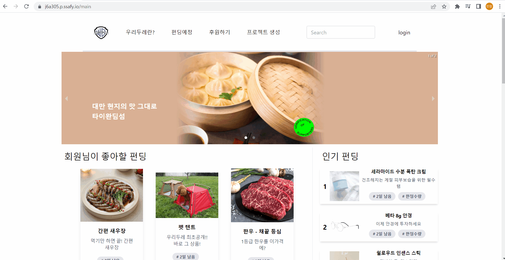
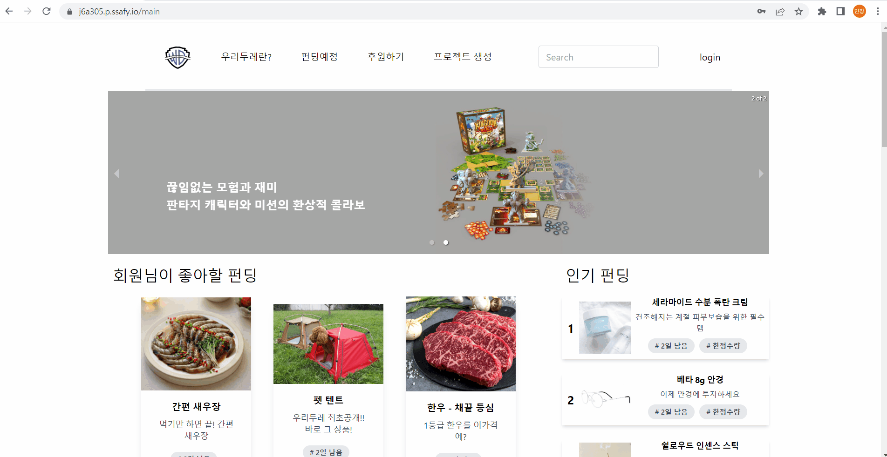

# Woori Doore (우리두레)

## 프로젝트 소개

`우리두레`는 기존 플랫폼에서 진행되던 공동구매·소규모 펀딩의 **신뢰성 문제**를 블록체인으로 해결하기 위한 펀딩 플랫폼입니다. 펀딩 주최자와 플랫폼에 대한 신뢰를 블록체인 스마트 컨트랙트로 확보하여, 안심하고 투자·후원할 수 있도록 했습니다.

> 학기 특화(심화) 팀 프로젝트로 진행했습니다.

## 기술 스택

**Frontend**
- Next.js 12, React 17
- MUI(Material UI), Emotion, framer-motion
- **ethers.js** (블록체인 · 스마트 컨트랙트 연동)
- axios, react-quill(에디터), react-daum-postcode(주소 검색)

**Backend**
- Java, Spring Boot, Spring Data JPA, MySQL
- Spring Security + **OAuth2** (Google · Kakao · Naver 소셜 로그인, Resource Server)
- Swagger(springfox)

**Blockchain**
- Solidity 스마트 컨트랙트 (`back/blockchain/temp_solidity/FundRaising.sol`) — 펀딩 모금 로직

## 주요 기능

- **펀딩** — 펀딩 프로젝트 생성·조회·투자, 진행 내역(History) 관리
- **블록체인 결제/모금** — 스마트 컨트랙트 기반 펀딩 모금 및 신뢰성 확보 (ethers.js 연동)
- **회원** — OAuth2 소셜 로그인(Google/Kakao/Naver), 프로필
- **커뮤니티** — 게시판, 댓글, Q&A, 팔로우
- **커머스 부가 기능** — 카테고리, 검색, 배송(Delivery)·배송 추적(Track), 파일 업로드

## 프로젝트 구조

```
back/        Spring Boot + JPA REST API, OAuth2, 블록체인 연동
  blockchain/  Solidity 스마트 컨트랙트
front/       Next.js + React 웹 클라이언트 (ethers.js)
docs/        팀별 산출물 문서
exec/        배포 관련 자료
```

## 데모

| 메인페이지 | 메인페이지 스크롤 |
|---|---|
|  |  |

| 로그인 | 페이지 소개 |
|---|---|
|  |  |

## 참고

- `back/src/main/resources/application.properties`·`application.yml`에 하드코딩된 자격증명(DB 비밀번호, OAuth2 client-secret)이 남아 있어, 별도의 보안 정리(자격증명 폐기·재발급, 환경변수 이전)가 필요합니다.
