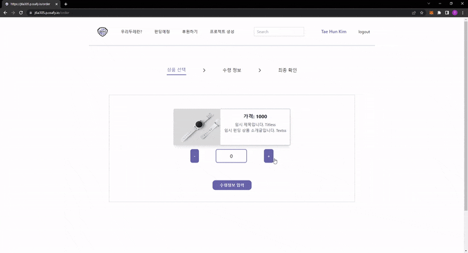

1. Tae Hun's readme

   <hr>


   목차:

   - [자기소개](#자기소개)
   - [마주한이슈들](#마주한이슈들)
   - [추후개선안](#추후개선안)
   - [프로젝트후기](#프로젝트후기)

   <br>

   <br>

   ### 자기소개

   - Front-end 담당

     - <detail> <summary>김태훈</summary>

       - 펀딩 상세페이지 담당

         - 펀딩 상품의 상세정보 제공 & 해당 펀딩 상품의 옵션 제공

           

         - 해당 펀딩 관련 공지사항 생성 및 조회

           

         - 해당 펀딩 관련 QnA 생성 및 조회

           

         - 공지사항과 QnA 생성을 위한 모달창 제공

         <br>

       - 후원하기 페이지 (펀딩 목록 페이지) 담당

         - 펀딩의 카테고리 navbar 제공

         - 펀딩 상세페이지로 라우팅 되는 펀딩 상품 카드 제공

           


         <br>

       - 결제페이지 담당

         - 결제 프로세스 navbar 제공

         - 수령자 정보 입력 컴포넌트 제공

           

           

         - 수령자 주소 입력창 Daum 우편번호 서비스 api와 연동하여 모달창으로 제공

         - 전화번호 입력창에서 자동 " - " 입력 제공

           

         - 선택된 펀딩 상품 옵션 및 수령자 정보의 상태정보 관리

         - 최종확인 컴포넌트에 선택된 펀딩 상품 정보 반영

         <br>

       - 사용자 상태정보 관리 및 로그인 페이지 (OAuth 로직 제외) 담당

         - 플랫폼 별 OAuth 로그인 지침에 준수한 로그인 페이지 제공
         - 페이지 새로고침 될 때마다 로그인 상태 정보 확인 및 변경점 반영 로직 제공

         </detail>

   <br>

   <br>

   ### 마주한이슈들

   1. <detail> <summary><u>비동기 작업으로 인한 상태정보 관리 문제</u>  : 사용자 정보 상태관리에서 발생한 이슈</summary>

      - ```react
        // [ setUserSeq 함수로 userSeq의 상태값이 반영되기 전에 if문으로 들어가버려 setIsLoggedIn 함수가 실행되지 않는 문제 ]
        const [userSeq, setUserSeq] = useState('');
        
        const getUserInfo = async () => {
            const data = await fetch('https://j6a305.p.ssafy.io/api/user/check');
            try {
                const temp = await data.json();
                console.log('JSON화 유저정보: ', temp);
                await setUserSeq(temp.userSeq);
                await setUserInfo(temp);
                if (userSeq) {						// 문제의 if 문
                  setIsLoggedIn(true);
                }
            } catch {
                console.log('사용자가 아닙니다');
            }
          }
        ```

        ```react
        // [ callback 함수로, 함수 실행 순서를 정의해도 될것 같았습니다만, 가독성이 떨어져 보였습니다. ]
        ...
        	setUserSeq(temp.userSeq, function () {
                if (userSeq) {
                  setIsLoggedIn(true);
                }
        	})
        ...
        ```

        ```react
        // [ 결론적으로 if 문의 condition을, 애초에 fetch하여 받아오게 되는 temp의 정보로 변경하여 해결하였습니다. ]
        ...
            if (temp.userSeq) {
                  setIsLoggedIn(true);
                }
        ...
        ```

        </detail>

      <br>

      <br>

   ### 추후개선안

   1. <detail> <summary>빌드 시 모든 상세 펀딩 페이지의 dynamic route 생성 => 빌드 시 dynamic하게 생성할 상세 펀딩 페이지 개수 제한</summary>

      - ```react
        // [ 기존에는 생성할 상세 펀딩 페이지 수 가 적어 모든 dynamic paths 를 빌드 시 생성하였습니다. ]
        
        export const getStaticPaths = async () => {
          const res = await fetch('https://j6a305.p.ssafy.io/api/funding/lists/1', {"sort": 1});    // 펀딩 리스트 get 요청
          const data = await res.json();
        
          const paths = data.data.map(fund => {
            return {
              params: {id: fund.fundingSeq.toString()}	// 라우트팅에 활용할 id값 return ([id].js 과 key 값의 이름이 동일해야함)
            }
          })
        
          return {
            paths: paths,     // key값 이름이 paths인것은 convention 이고, 해당 값은 아래의 getStaticProps 의 context값으로 자동 전달됩니다.
            fallback: false,  // 유효하지 않은 id값의 페이지로 라우팅 되면 자동으로 404페이지 표시 
          }
        }
        ```

      - ```react
        // [ 하지만 추후 수백개의 펀딩 상품페이지의 dynamic paths를 전부 빌드시 static site generation 하는건, 빌드 시간이 늘어나 원활한 CD/CI에 악영향이 있을거라 생각했습니다. ]
        
        // [ 고로, 아래와 같이 `getStaticProps fallback: true` 를 활용하여 일정 개수만 빌드시 dynamic paths를 생성함으로서 DX 를 개선하고, UX도 유지하기 위해서 빌드시 미생성 된 dynamic paths는 클릭 시 마다 dynamic paths를 생성 + 리액트의 `Suspense`를 활용하여 페이지 로딩 시 준비된 로딩 페이지를 보여주면 좋겠다 생각했습니다. ]
        export const getStaticPaths = async () => {
            ...
            return {
                paths: paths,
                fallback: true,
            }
        }
        
        const Detail = ({fund, fundingSeq}) => {
            ...
            return (
            	...
                <Suspense fallback={<Loader />}>
                	<ProductQNA fundingSeq={fundingSeq} />
                </Suspense>
                ...
            )
        }
        ```

        </detail>

      <br>

   2. <detail> <summary>정말 난잡했던 상태관리 => 상태관리 라이브러리 활용하여 개선</summary>

      - 심플하게 상태 관리가 너무 난잡했습니다.
        코드의 가독성, 재사용성, 비동기 작업 로직의 직관성, 디버깅 환경 개선, 등 을 위해서 modular design 에 기반하여 개발을 진행했습니다.
        그러다보니 필연적으로 props drilling 현상이 너무나도 자주 일어났고, 상태 정보의 이동 과정이 복잡해지는 만큼 잦은 휴먼에러가 있었고, 가독성도 매우 떨어졌습니다.
      - 다음에는 Redux와 같은 상태관리 라이브러리를 활용하여 modular design을 준수함과 동시에 조금더 클린한 상태관리를 구현할 수 있다면, modular design의 장점을 가져감과 동시에 코드의 가독성, 디버깅 환경 개선, 등 DX적인 면에서 개선의 여지가 많지 않을까 생각했습니다.
      - 또한, 글로벌 상태정보 관리 방법은 개발 들어가기 전에 확립해야한다는 것을 뼈저리게 느꼈습니다.
        그래야만이 팀원간의 상태정보 collision 없이, 구현 테스트도 바로바로 할 수 있어서 조금 더 원활한 개발이 진행될거라 생각했습니다.

      </detail>

      <br>

   3. <detail> <summary>새로운 펀딩 등록 시 실시간 반영 기능 부재 => Incremental Site Regeneration (ISR) 활용하여 해결</summary>

      - 마무리 단계에서 테스트를 하던 중, 생성한 펀딩이 실시간으로 반영되지 않는 문제를 발견했습니다.
        Static Site Generation 을 활용한터라, 빌드시 펀딩 상품 정보들이 화면에 그려지는게 원인이였습니다.
        고로 새로운 펀드 상품들을 반영하기 위해서는 front-end 를 rebuild 할 필요가 있었습니다.
      - 이에대한 해결책으로서 Incremental Site Regeneration (ISR)을 활용하여 해결할 수 있을거라 생각합니다.
        이는 지정한 주기로 Server-side rendering을 진행하여 새롭게 update된 펀딩 상품을 front-end에 반영해주는 next.js의 비교적 최신 기능입니다.
      - 하지만 해당 방법도 완벽한 대안은 하니라 생각합니다.
        ISR 은 아래와 같이 atomic and immutable 배포의 구조를 허물게 됩니다. 
        
        이는 캐시된 페이지 버전의 일관성을 깨뜨리기 떄문에, 다른 버전의 데이터 페이지로 라우팅이 되는 등, 예상 못할 버그가 발생할 여지가 생깁니다.
        또한 이러한 문제는 디버깅 하기도 까다로운데, 개발자와 문제를 겪고있는 사용자가 같은 버전의 캐시된 페이지를 바라보고 있지 않을 수 있기 떄문입니다.

      </detail>

      <br>

   <br>

   ## 프로젝트후기

   1. 시간관리는 어렵다? 사회인들 모두 시간관리는 어렵다.

      - 프로젝트와 취업활동을 병행하여 시간 관리가 어려웠고, 도중에 이사를 가게되어서 프로젝트를 무사히 마치려면 평소 이상으로 시간관리를 엄격하게 지켜야했습니다. 이러한 변수를 생각하지 않고 프로젝트 기획을 하였기 떄문에, 변수가 작용 할 수록 부담은 커져갔습니다.

        밤잠설치며 프로젝트는 마무리 했지만, 직후 몸 상태가 않좋아져, 다음 프로젝트 전 마지막 주말을 집에 누워서 지내게 되었습니다.

        실제 직장을 다니게 되면 정말 많은 일을 병행해야하는 상황에 놓일거라 생각합니다. 그리고 책임이 늘어남과 동시에 다양한 변수도 늘어난다 생각합니다. 정말 어렵겠지만, 항상 어느정도의 여유를 두고 계획을 짬으로서 변수에 대응할 수 있는 자세를 유지하는것도 만족스러운 사회생활을 보내기 위한 하나의 덕목이라는 생각이 들었습니다.

        하지만, 그러기 위해선 주어진 업무 시간에 최대한 많은것을 해내는 실력과 집중력이 많이 필요하다 느꼈고, 그만큼 꾸준히 실력을 갈고닦아야함도 느꼈습니다.

        일을 하기 위한 삶이 아닌, 삶을 위해 일을 하도록.

   2. 