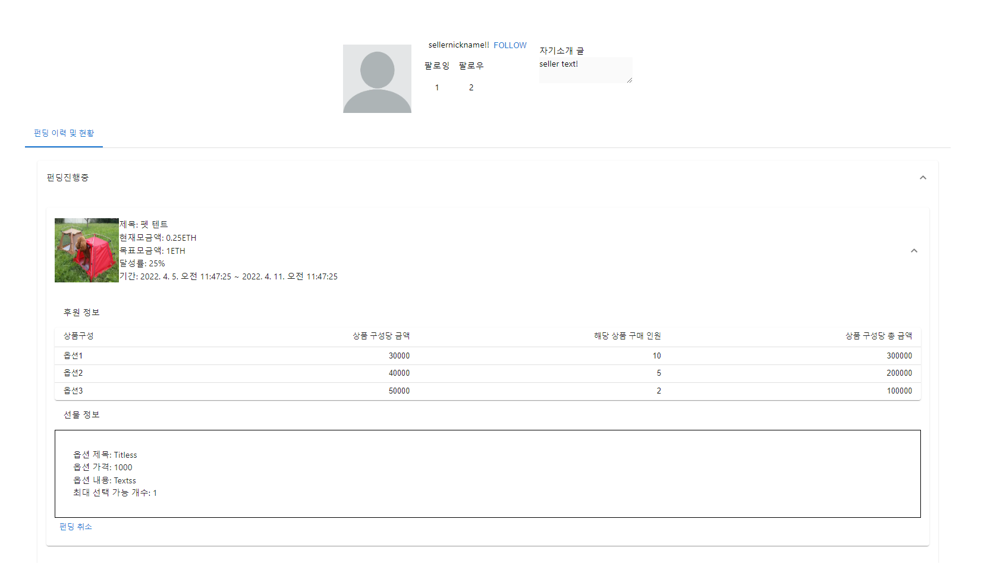
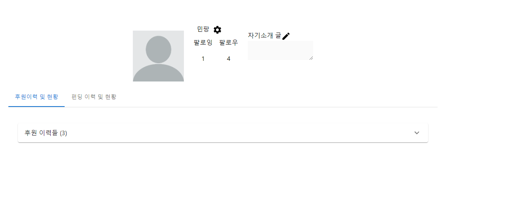
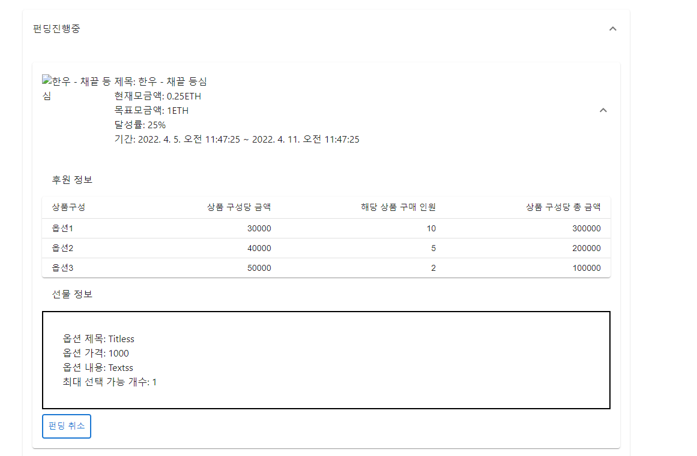
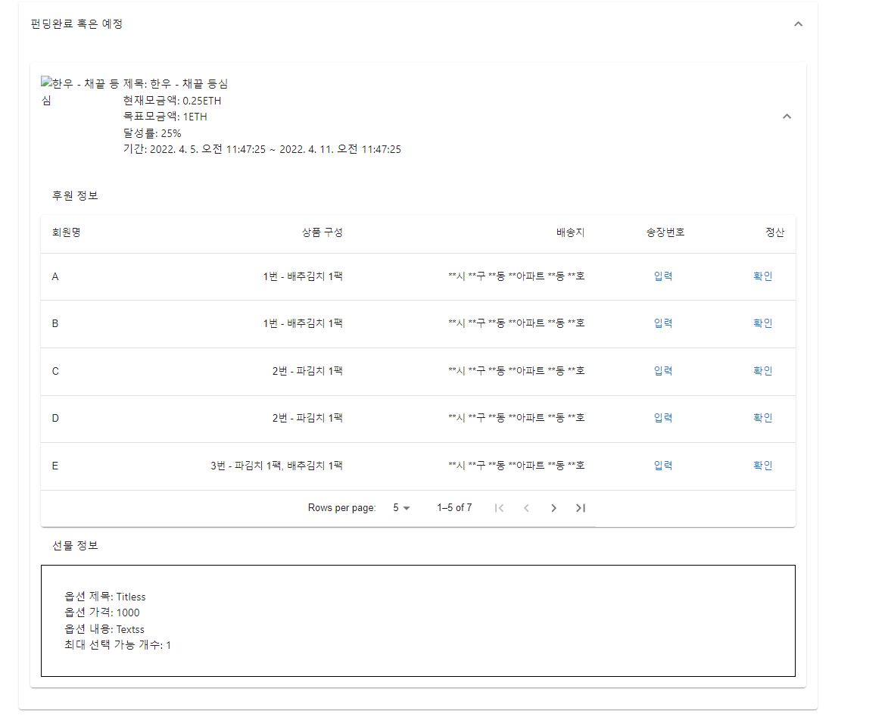
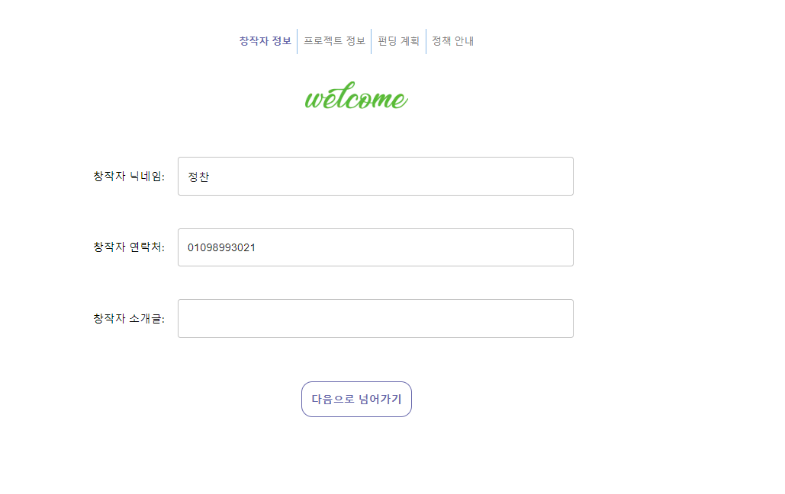
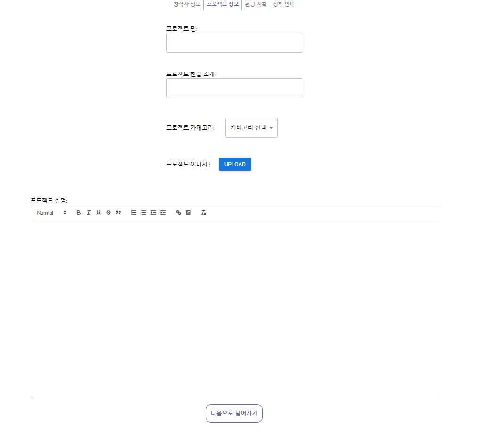
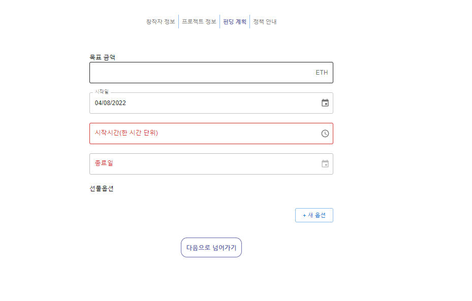
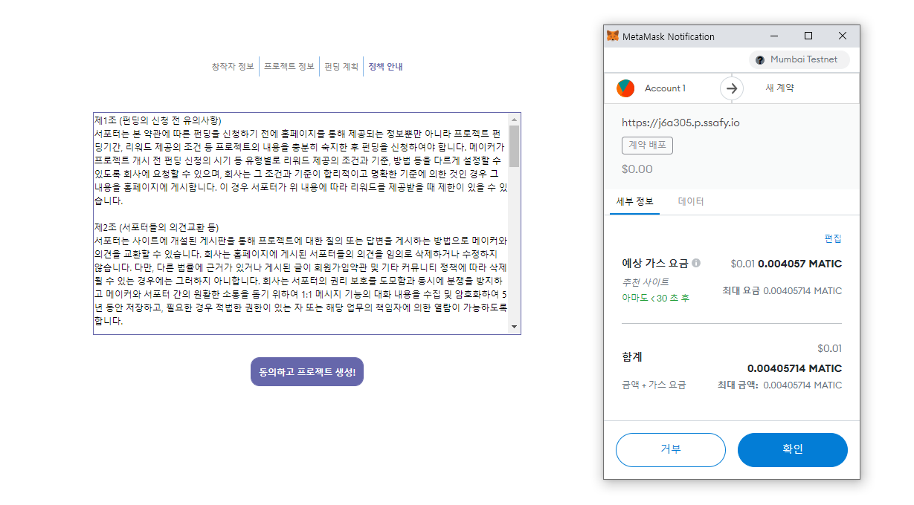
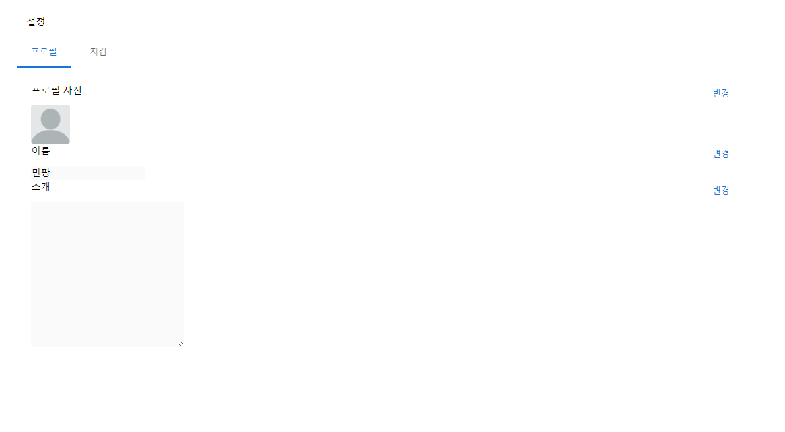
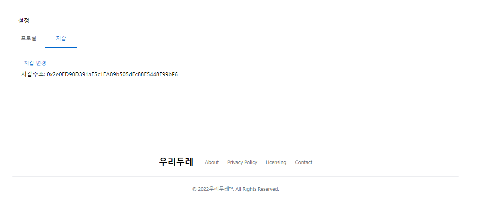

## 구현 하려했거나 구현한 부분 - 페이지 기반

:boom: : 실패

:heavy_check_mark: : 성공

:pause_button: : 반반

1. 새로운 펀딩을 만드는 페이지 :heavy_check_mark:
   1. 텍스트 에디터를 적용한 이미지도 넣을 수 있는 펀딩 설명 작성:boom:
   2. 세세한 부분들
      1. 연락처를 000-0000-0000의 형태로 구분:boom:
      2. 한 개씩 완료할 때마다 체크표시로 알려주기:boom:
      3. 목표금액 3자리마다 ,로 구분:boom:
   3. 스마트 컨트랙트와 연동 :heavy_check_mark: - 하지만 내가 하지 않은 부분
   4. 유효성 검사 :boom:
2. 프로필 페이지 :heavy_check_mark:
   1. 후원, 펀딩 내역 보여주기 :heavy_check_mark:
   2. 팔로잉, 팔로우 기능 :pause_button: - 언팔로우 기능이 제대로 작동하지 않음
   3. 종료한 경우와 진행중인 경우를 나누어서 정보를 보여주기 - 테이블로 정산을 할 수 있도록 등등 :pause_button: - 만들었지만 기능 작동은 구현하지 못함

3. 유저 설정 페이지 :heavy_check_mark:
   1. 지갑 연동 :heavy_check_mark:
   2. 개인 정보 수정 :heavy_check_mark:

## 프로젝트의 진행 과정 중 겪은 문제들

프로젝트를 진행하면서 여러 가지 문제 상황들을 직면했다. 그 상황들은 다음과 같다.

1. 비동기 문제 - useEffect() 내부에서의 문제
2. ssr과 관련된 문제

### 비동기 문제

useEffect()내에서 여러 가지 데이터들을 axios로 가져와서 이 데이터들로 setState()를 하려고 하다보니 문제가 발생했다. 일단 원하는 순서대로 진행이 되지 않았다. 일단 setState()가 비동기 형식이라는 것을 알았기 때문에 async() await를 이용해서 제어를 하려고 헀다. 하지만 이것은 작동하지 않았다. 솔직히 말하면, setState()는 큰 문제가 아니었다. 

가장 큰 문제는 array 혹은 object 형태의 데이터를 useEffect()를 사용하여 분할하려고 하면 React DOM이 제대로 작동하지 않는 것이 문제였다. 예를 들어, 실제 내가 겪은 상황을 예시로 들어보자. 펀딩데이터를 axios로 불러오고, 해당 데이터를 날짜를 기준으로 분할하려고 했다. 한마디로 axios => function split()을 하려고 하였다. 내 계획대로라면 axios => split이 되어야 하는데, 계속해서 split() => axios의 형태가 되거나 axios => split()의 형태가 되어도 DOM이 제대로 작동하지 않는 문제가 생겼다. 

이 문제를 해결하기 위해 useEffect의 개념을 다시 찾아보고, 그 안에 함수를 넣었다가 fetch로 async await의 형태를 사용하는 등의 시도를 해보았다. 심지어 이 문제를 해결할 방법이 Next.js의 getInitialProps 등을 사용해서 ssr로 해결해 보려고도 하였다. 결국 실제 문제를 해결한 방법은 더 작은component로 나누어서 array의 형태의 data를 prop하고 prop하여 하나의 값으로 사용가능할 때까지 구분하여 prop.data를 직접적으로 사용하는 방법이었다.

### ssr과 관련한 문제

이 문제는 texteditor를 적용하려고 하면서 발생하였다. 펀딩을 소개하기 위해서는 일반적인 textarea와 같이 문자로만 이루어진 형태의 입력은 적절하지 않다고 생각하였다. 그렇기에 이미지를 넣을 수 있는 texteditor를 사용하려고 하였고, 여러 texteditor 중에 react-quill이 적용하기에는 가장 쉬울 것 같아서 그것을 선정하였다. 하지만 이것을 실제 적용하면서 문제가 발생하였다. 

먼저 ssr은 화면에서 보여줄 페이지를 서버 단에서 렌더링 한 후에 클라이언트에게 제공하게 된다. 하지만 react-quill은 document를 조작하는 라이브러리이다. 따라서 ssr에서의 작동되어야 하는 순서는document 정의 => react-quill로드 => react-quill이 document 조작 순이어야 한다. 하지만 실제 작동하는 순서는 react-quill로드=>react-quill이 document조작=>document 정의의 형태이다. 따라서 react-quill이 import되는 순서를 제어해야 했다.

이것을 dynamic import (import dynamic from 'next/dynamic')을 통해 해결하였다. 이것을 사용하면 Quill Editor를 서버 측 모듈에 포함하지 않고 런타임시에 모듈을 import 할 수 있기 때문에 작동되어야 하는 순서를 맞출 수 있는 것이다. 이렇게 순서는 맞추었지만, 실제 이미지를 넣고 rendering하는 과정에서 문제가 발생하였다. 이미지를 넣는 그 순간에는 이미지 경로로 이미지를 읽어올 수 없었다. 하지만 다음에 다시 서버를 배포하면 그 전의 이미지 경로로 이미지를 읽어올 수 있게 되었다. 그래서 ssr의 문제인지 아니면 nginx의 문제인지 알 수는 없었지만, 일단 갈 길이 급해서 이 문제는 뒤로 미루어 두었다.

## 실제 구현한 페이지 이미지

### 프로필 페이지

1. 펀딩 이력 및 현황

2. 후원 이력 및 현황

3. 펀딩진행중

4. 펀딩종료

### 펀딩 개설 페이지

1. 창작자 정보 컴포넌트

2. 프로젝트 정보 컴포넌트

3. 펀딩 계획 컴포넌트

4. 정책 안내 및 펀딩 진행

### 유저 설정 페이지

1. 프로필 설정

2. 지갑 연동

